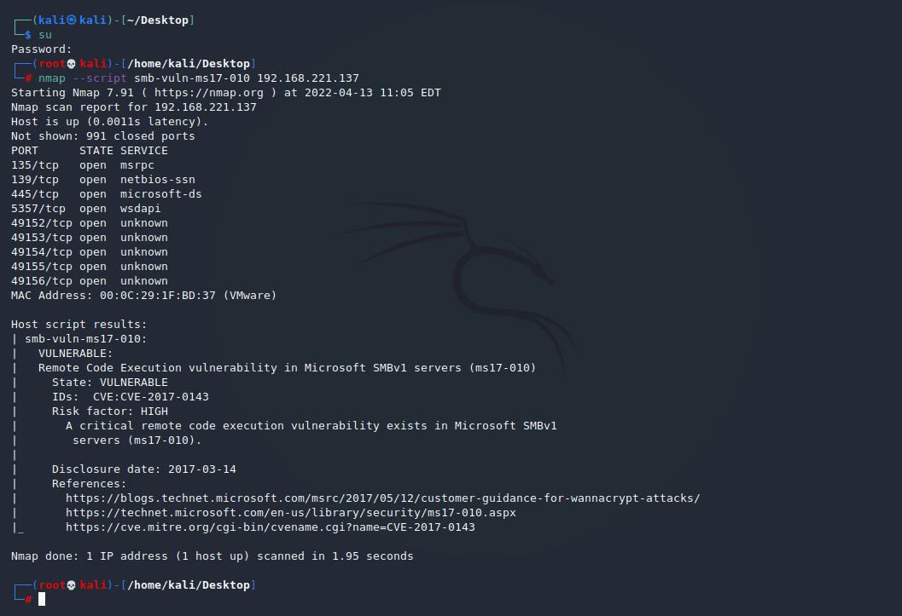
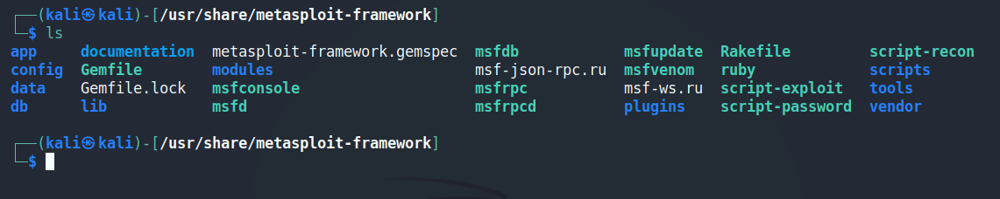
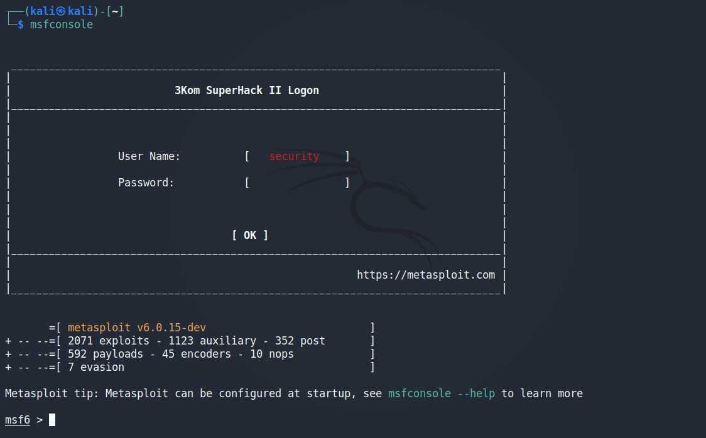
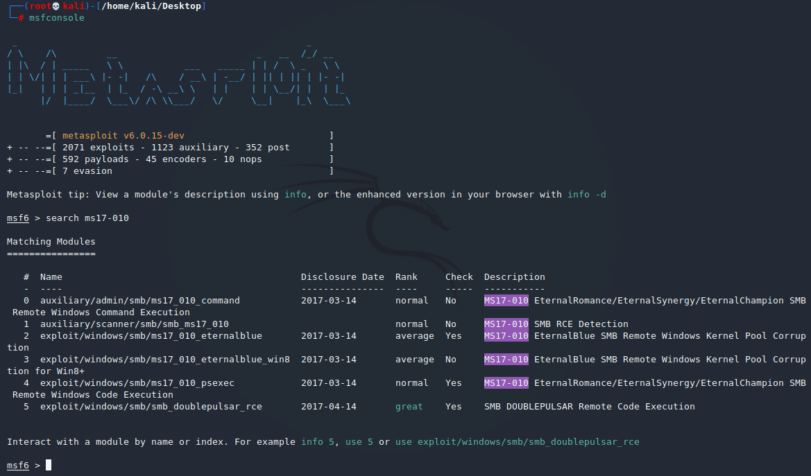
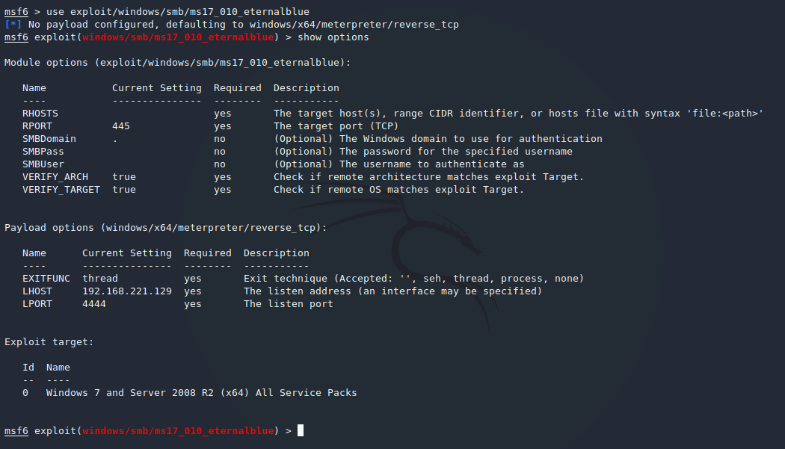
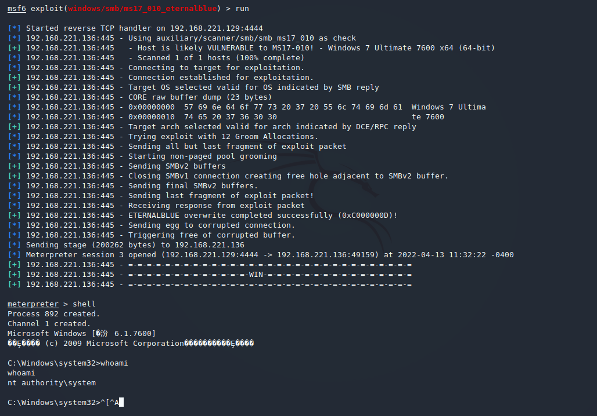
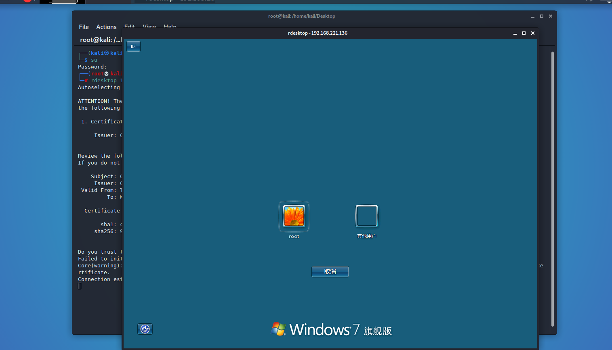
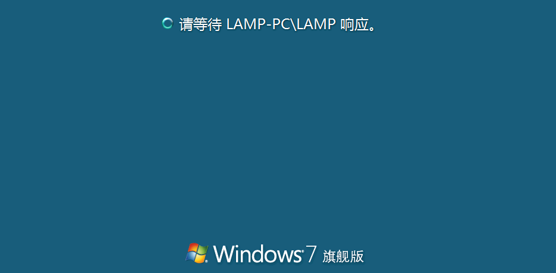
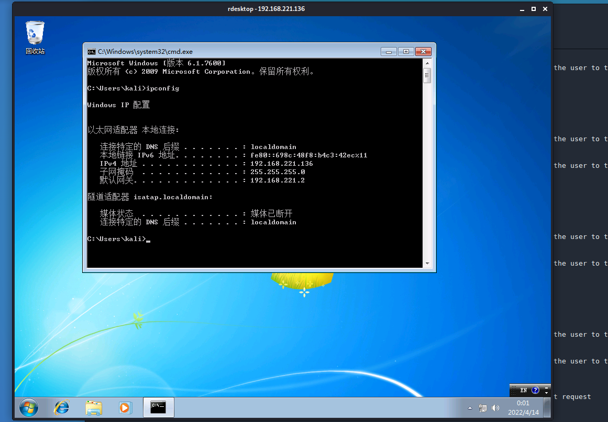
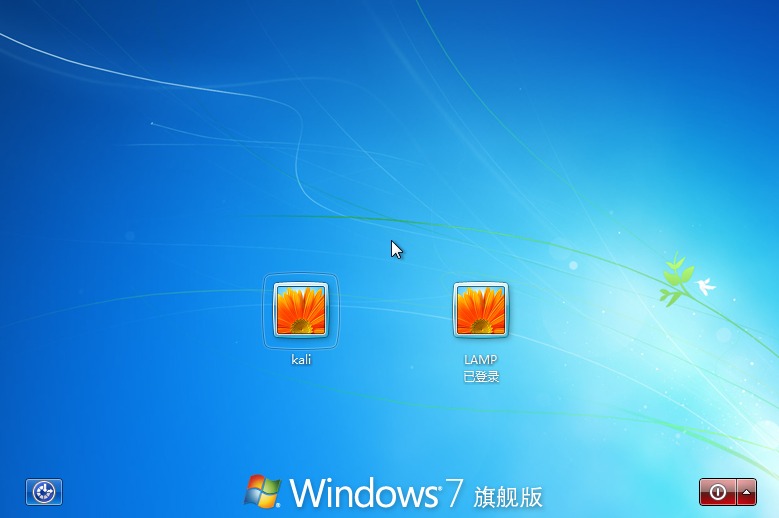

# 永恒之蓝(Eternal Blue)

永恒之蓝漏洞爆发于2017年4月14日晚，是一种利用Windows系统的SMB协议漏洞来获取系统的最高权限，以此来控制被入侵的计算机。

2017年5月12日起，全球范围内爆发基于Windows网络共享协议进行攻击传播的蠕虫恶意代码，这是不法分子通过改造之前泄露的NSA黑客武器库中“永恒之蓝”攻击程序发起的网络攻击事件。五个小时内，包括英国、俄罗斯、整个欧洲以及中国国内多个高校校内网、大型企业内网和政府机构专网中招，被勒索支付高额赎金才能解密恢复文件，对重要数据造成严重损失。

### SMB（全称是Server Message Block）
是一个协议服务器信息块，它是一种客户机/服务器、请求/响应协议，通过SMB协议可以在计算机间共享文件、打印机、命名管道等资源，电脑上的网上邻居就是靠SMB实现的；SMB协议工作在应用层和会话层，可以用在TCP/IP协议之上，SMB使用TCP139端口和TCP445端口。

### SMB工作原理是什么？

（1）：首先客户端发送一个SMB negport 请求数据报，，并列出它所支持的所有SMB的协议版本。服务器收到请求消息后响应请求，并列出希望使用的SMB协议版本。如果没有可以使用的协议版本则返回0XFFFFH，结束通信。

（2）：协议确定后，客户端进程向服务器发起一个用户或共享的认证，这个过程是通过发送SessetupX请求数据包实现的。客户端发送一对用户名和密码或一个简单密码到服务器，然后通过服务器发送一个SessetupX应答数据包来允许或拒绝本次连接。

（3）：当客户端和服务器完成了磋商和认证之后，它会发送一个Tcon或TconX SMB数据报并列出它想访问的网络资源的名称，之后会发送一个TconX应答数据报以表示此次连接是否接收或拒绝。

（4）：连接到相应资源后，SMB客户端就能够通过open SMB打开一个文件，通过read SMB读取文件，通过write SMB写入文件，通过close SMB关闭文件。

# 攻击复现

## 漏洞描述
Eternalblue通过TCP端口445和139来利用SMBv1和NBT中的远程代码执行漏洞，恶意代码会扫描开放445文件共享端口的Windows机器，无需用户任何操作，只要开机上网，不法分子就能在电脑和服务器中植入勒索软件、远程控制木马、虚拟货币挖矿机等恶意程序。

目前已知受影响的 Windows 版本包括但不限于：Windows NT，Windows 2000、Windows XP、Windows 2003、Windows Vista、Windows 7、Windows 8，Windows 2008、Windows 2008 R2、Windows Server 2012 SP0。

## 实验环境

* VMware
* 攻击 Kali Linux
* 靶机 win7

## 实验过程

### Nmap扫描

---
#### Host Discovery

默认情况下，Nmap 会进行主机发现（Host Discovery），然后对它确定在线的每个主机执行端口扫描（port scan）。

    使用 -Pn 跳过Host Discovery

其中，Host Discovery包括（当是特权用户时，简单说root权限）：

    an ICMP echo request
    a TCP SYN packet to port 443
    a TCP ACK packet to port 80
    an ICMP timestamp request

当由非特权用户执行时，Host Discovery只包括:

    SYN packets are sent (using a connect call) to ports 80 and 443

端口 open|fliter状态， 靶机防火墙设置了规则。

--help 查看更多扫描模式

---
对靶机进行 ms17-010脚本扫描

### Metasploit Framework

---
Metasploit 是一款强大的渗透框架。 H.D. Moore在2003年发布MSF时，计算机安全状况也被永久性地改变了。仿佛一夜之间，任何人都可以成为黑客，每个人都可以使用攻击工具来攻击那些未打过补丁或者刚刚打过补丁的漏洞。软件厂商再也不能推迟发布针对已公布漏洞的补丁了，这是因为MSF团队一直都在努力开发各种攻击工具，并将它们贡献给所有MSF用户。

#### 渗透攻击（Exploit）
渗透攻击是指由攻击者或者渗透测试者利用系统、应用或服务中的安全漏洞，所进行的攻击行为。

流行的攻击技术包括：缓冲区溢出、Web应用程序漏洞攻击，以及利用配置错误等。
#### 攻击载荷（Payload）
攻击载何是我们期望目标系统在被渗透攻击后而执行的代码。在MSF框架中可以自由的选择、传送和植入。

反弹式shell是一种从目标主机到攻击主机创建网络连接，并提供命令行shell的攻击载荷。

bind shell攻击载荷则在目标主机上将命令行shell绑定到一个打开的监听端口，攻击者可以连接这些端口来取得shell交互。

#### 代码（shellcode）
shellcode是在渗透攻击时作为攻击载荷运行的一组机器指令。shellcode通常用汇编语言编写。在大多数情况下，目标系统执行了shellcode这一组指令后，才会提供一个命令行shell或者Meterpreter shell，这也是shellcode名称的由来。

####  模块（Module）
在MSF中，一个模块是指MSF框架中所使用的一段软件代码组件。在某些时候，你可能会使用一个渗透攻击模块（Exploit module），也就是用于实际发起渗透攻击的软件组件。而在其它时候，则可能使用一个辅助模块（auxiliary module），用来扫描一些诸如扫描或系统查点的攻击动作。

#### 监听器（Listener）
监听器是MSF中用来等待连入网络连接的组件。举例来说，在目标主机被渗透攻击之后，它可能会通过互联网回连到攻击主机上，而监听器组件在攻击主机上等待被渗透攻击的系统来连接，并负责处理这些网络连接。

#### MSF Kali下存放目录：/usr/share/MSF-framework/

---
更新 metasploit ，并开启 msfconsole

    apt install metasploit-framework
    msfconsole

查找 Eternal-blue 漏洞

use 2， 设置 payload，使用show options 查看攻击设置

设置攻击目标。

    set rhost 192.168.221.137
    show options
    run

run 渗透。

meterpreter shell命令

    whoami
    nt authority\system

nt authority\system 代表程序以系统身份运行，系统内置的系统账户。
system账户具有比administration更高的权限。

### meterpreter

后渗透

在win中创立网络用户，赋予管理员权限

    net user username password /add
    net localgroup administrators username /add
    REG ADD HKLM\SYSTEM\CurrentControlSet\Control\Terminal" "Server /v fDenyTSConnections /t REG_DWORD /d 0 /f

kali 新终端 
    
    rdesktop 192.168.221.136

选择其他用户 稍等片刻。

此时靶机 退出登录

后渗透。。。。

meterpreter退出

    ‘Ctrl + \’

