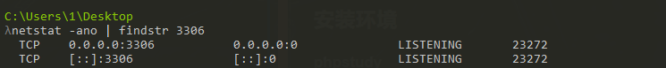
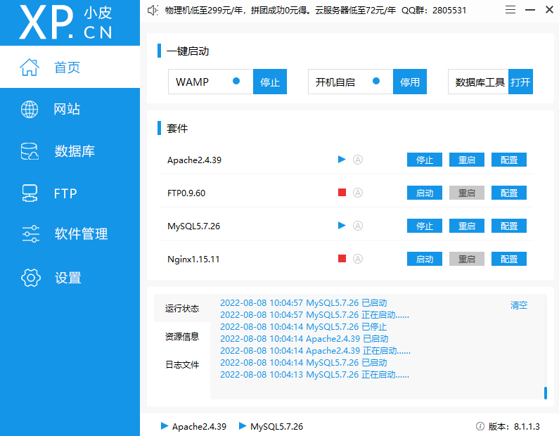

# DVWA
##  安装环境
### 1 phpstudy
如果之前安装过mysql，启动会失败。执行下面命令

    netstat -ano | findstr 3306

啥都没有，表明端口没被占用。

出现下面的LiSTENING表示端口被监听

解决：管理-服务-停止之前的mysql服务。

    

### 2 dvwa-2.0.1 复制到网站根目录

删掉config后缀

修改php.ini, 创建数据库 重启服务    

### 3 抓包工具 brupsuit

    https://www.ddosi.org/burpsuite2021-8-3/

sha256 md5 校验

certutil -hashfile 文件名 校验值

    certutil -hashfile brupsuit sha256
    certutil -hashfile brupsuit md5
    
professional 激活 https://www.ddosi.org/burpsuite2021-8-3/

### 4 java 11

### 5 访问 127.0.0.1

    用户名：admin
    密码：password

### login failed
重新进入setup页面 create/reset database

    http://127.0.0.1/setup.php

