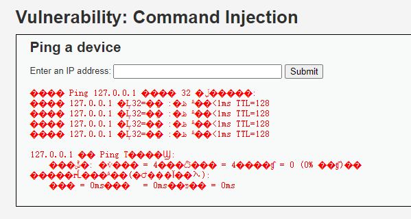
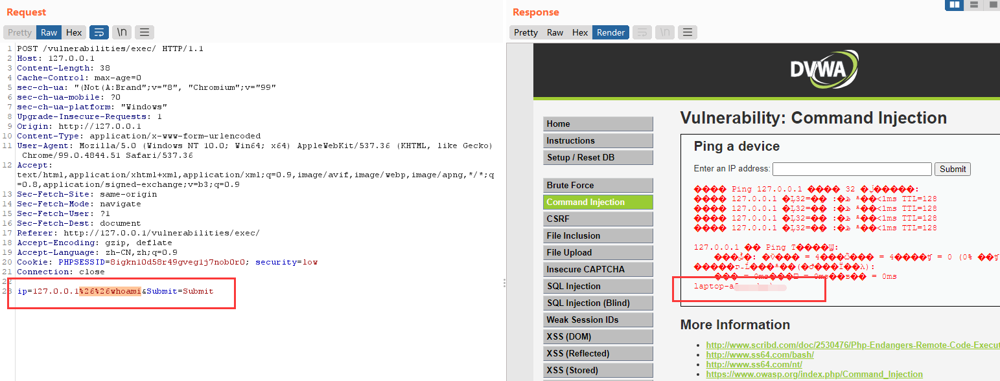
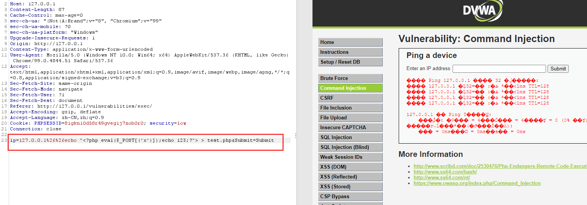
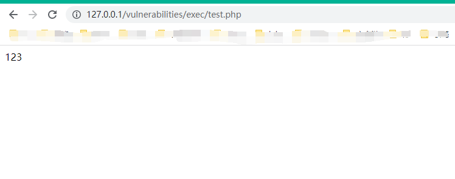
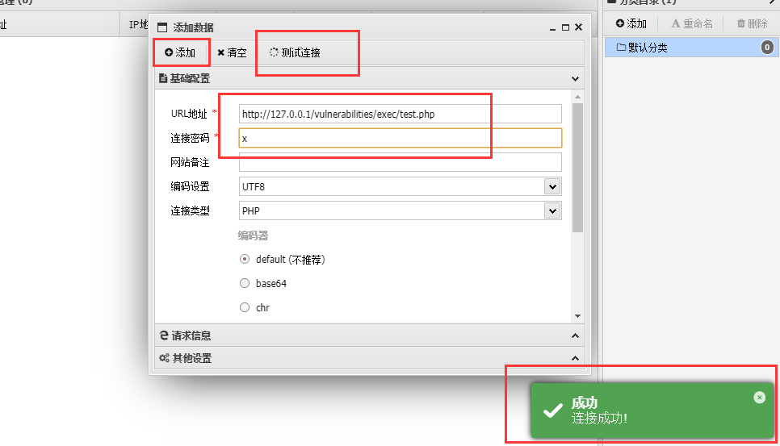
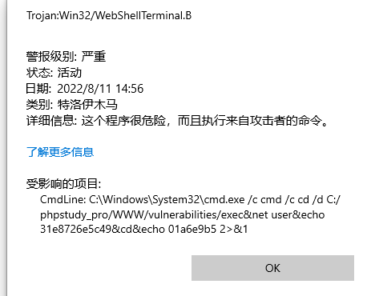

## 2 Command Injection
命令注入。输入 127.0.0.1 点submit。等四秒出现以下。

同样 brupsuit intercept on。 输入127.0.0.1 后，查看报文。 ctrl + r 。

修改报文，可以执行 whoami dir 等命令。 ctrl + u 转换url编码。

    echo test > test.php 

上传一句话木马。

echo “111” > 1.php 会写入“”， 采用 ^<php  ^> 方式写入，如下图。

使用antsword连接。

github 下载antsword。

如果执行命令行 会被defend杀。

