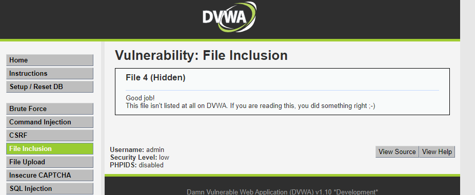
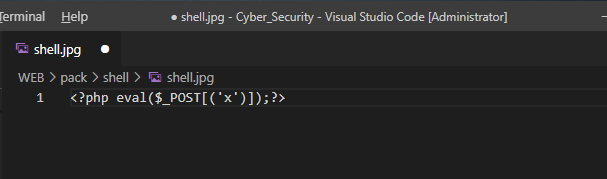
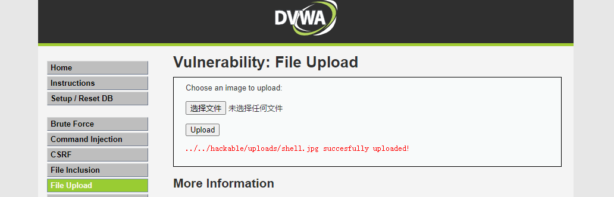
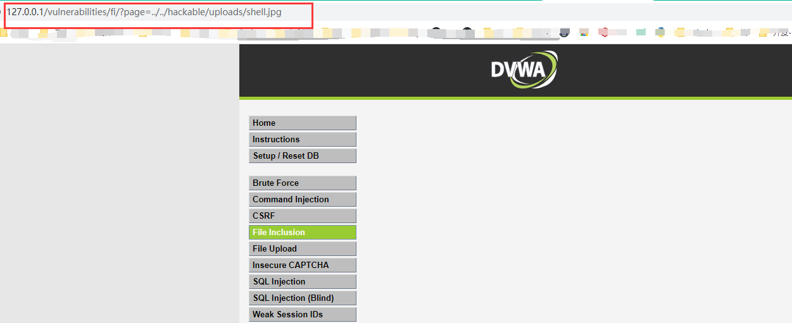
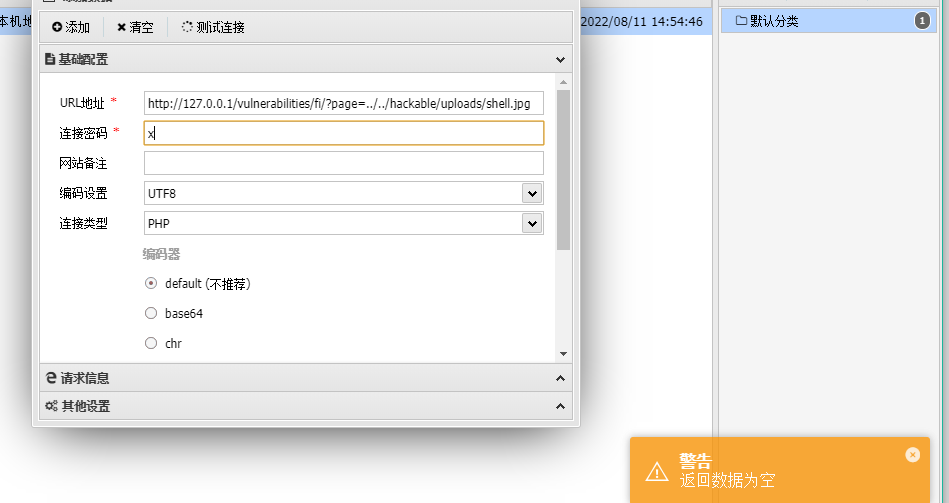
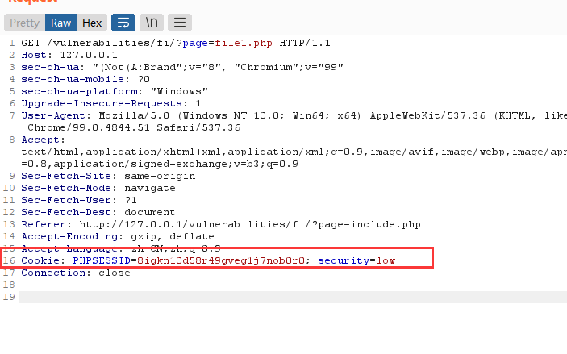
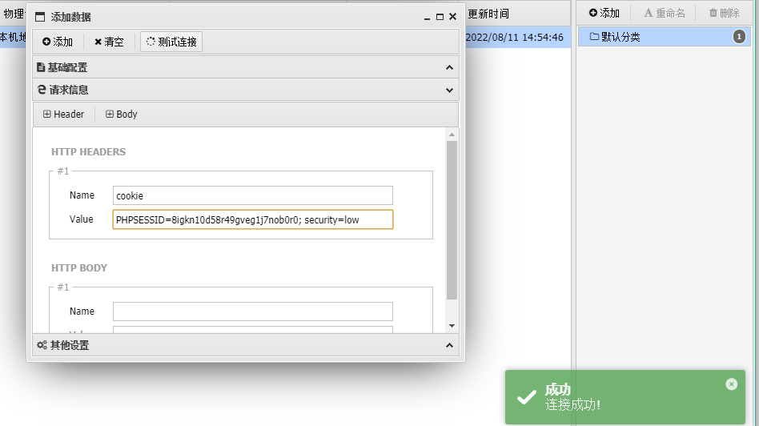

# 3 file inclusion file upload 文件上传与文件包含

文件包含： 观察url 盲猜 file4

----

文件上传： 上传webshell（jpg 直接写）,

 结合上一步盲猜url（加 ..\ ） 拿到url，上antsword。

返回为空。 需要添加cookie，brupsuit拦截报文。添加请求信息。

impossible 难度下会 校验图片内容，重命名图片。