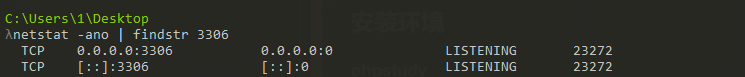

# DVWA
##  安装环境
### 1 phpstudy
如果之前安装过mysql，启动会失败。执行下面命令

    netstat -ano | findstr 3306

啥都没有，表明端口没被占用。

出现下面的LiSTENING表示端口被监听

解决：管理-服务-停止之前的mysql服务。

    

### 2 dvwa-2.0.1 复制到网站根目录

删掉config后缀

修改php.ini, 创建数据库 重启服务    

### 3 抓包工具 brupsuit

    https://www.ddosi.org/burpsuite2021-8-3/

sha256 md5 校验

certutil -hashfile 文件名 校验值

    certutil -hashfile brupsuit sha256
    certutil -hashfile brupsuit md5
    
professional 激活 https://www.ddosi.org/burpsuite2021-8-3/

### 4 java 11

### 5 访问 127.0.0.1

    用户名：admin
    密码：password

### login failed
重新进入setup页面 create/reset database

    http://127.0.0.1/setup.php

----
----

# 难度 LOW 
## 1 Brute Force 暴力破解

### 启动brup suit 

    java -jar brupsuit.exe

拦截包

    intercept on
    open browser
    在brute中输入 admin/123

然后ctrl + r 发送给 repeater。修改报文，点send可以重复发包。render 可以查看reponse网页。

ctrl + i 发送给 intruder。添加payload，攻击。

报文长度排序。

## 2 Command Injection
命令注入。输入 127.0.0.1 点submit。等四秒出现以下。

同样 brupsuit intercept on。 输入127.0.0.1 后，查看报文。 ctrl + r 。

修改报文，可以执行 whoami dir 等命令。 ctrl + u 转换url编码。

    echo test > test.php 

上传一句话木马。

echo “111” > 1.php 会写入“”， 采用 ^<php  ^> 方式写入，如下图。

使用antsword连接。

